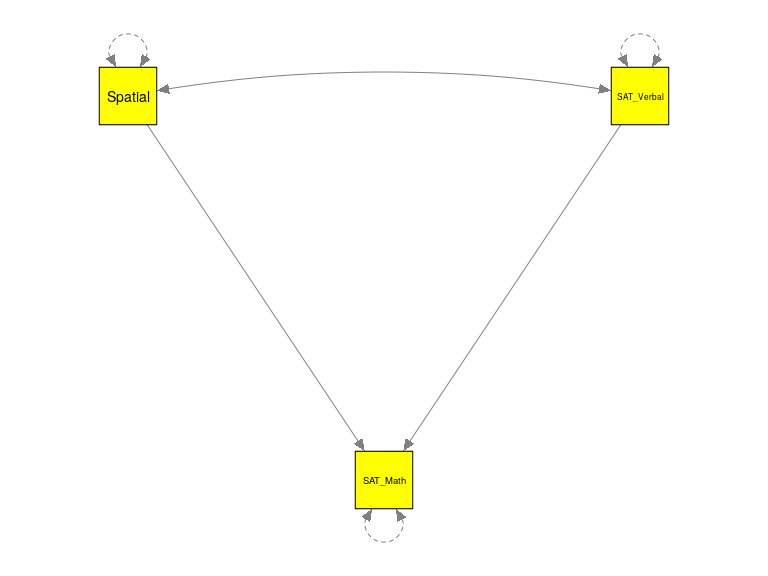
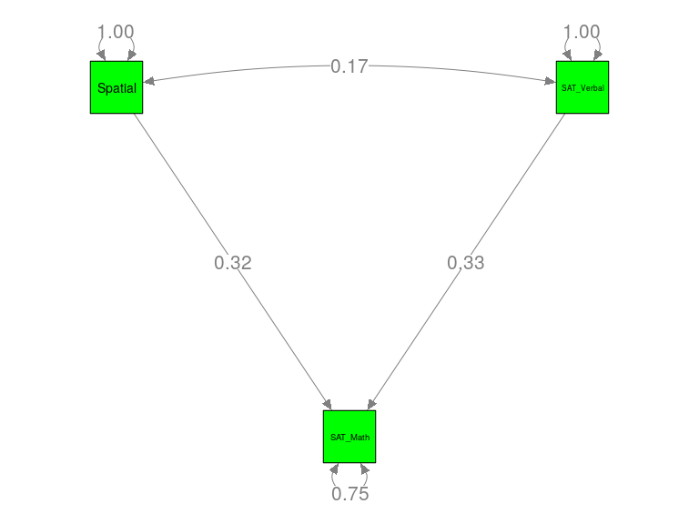

<style type="text/css">
body, td {
   font-size: 18px;
}
code.r{
  font-size: 16px;
}
pre {
  font-size: 16px
}
</style>


# My background
* Academic position:
    + Associate Professor at [Department of Psychology](http://www.fas.nus.edu.sg/psy/), the National University of Singapore (NUS),
    + Associate Professor (courtesy appointment) at [Department of Management & Organisation](https://bschool.nus.edu.sg/management-organisation), NUS.
* [Research interests](http://mikewlcheung.github.io/):
    + Quantitative methods,
    + Integrating meta-analysis into the structural equation modeling (SEM) framework. 
* Associate editors:
    + [Research Synthesis Methods](http://onlinelibrary.wiley.com/journal/10.1002/(ISSN)1759-2887)
    + [Neuropsychology Review](http://www.springer.com/biomed/neuroscience/journal/11065/PSE)
    + [Frontiers in Psychology (Quantitative Psychology and Measurement)](http://loop.frontiersin.org/people/8270/overview)
* Editorial boards:
    + [Psychological Methods](http://www.apa.org/pubs/journals/met/)
    + [Psychological Bulletin](http://www.apa.org/pubs/journals/bul/)
    + [Health Psychology Review](https://www.tandfonline.com/loi/rhpr20)
    + [Journal of Management](https://journals.sagepub.com/home/jom)
* Special issues:
    + Co-edited a special issue with [Adam Hafdahl](https://adamhafdahl.net/) on *Meta-Analytic Structural Equation Modeling* appeared in [*Research Synthesis Methods*](http://onlinelibrary.wiley.com/doi/10.1002/jrsm.v7.2/issuetoc).
    + Co-editing a special issue with [Suzanne Jak](http://www.suzannejak.nl/) on *Big Data in Psychology* that will appear in [Zeitschrift fuer Psychologie](https://conferences.leibniz-psychology.org/index.php/bigdata/bigdata2018/schedConf/cfp)

# Proposed schedule
* Introduction of MASEM
* Fixed-effects model
* Random-effects model
* Conclusions
* Q&A

# R packages
* [R project](http://www.r-project.org/)
* [RStudio](https://www.rstudio.com/): A powerful IDE for R. It is useful, but not compulsory, to have it for this workshop.
* The `metaSEM` package
    + [Website](https://cran.r-project.org/web/packages/metaSEM/index.html)
    + [Examples](https://cran.r-project.org/web/packages/metaSEM/vignettes/Examples.html)
    + [Paper](http://journal.frontiersin.org/article/10.3389/fpsyg.2014.01521/abstract)
* All workshop materials are available at [https://github.com/mikewlcheung/masemWorkshop](https://github.com/mikewlcheung/masemWorkshop).
* The analyses were based on R 3.5.1, `OpenMx` 2.11.5, and `metaSEM` 1.2.0.
* You may need to install the following packages in R before you can run the analyses.
	

```r
## Required packages for this workshop
lib2install <- c("metaSEM", "semPlot", "readxl")

## Install them automatically if they are not available on your computer
for (i in lib2install) {
  if (!(i %in% rownames(installed.packages()))) install.packages(i)
}
```

# Some resources

## Suggested readings  [](http://www.wiley.com/WileyCDA/WileyTitle/productCd-1119993431.html) 
* [Fixed-effects MASEM](https://courses.nus.edu.sg/course/psycwlm/Internet/papers/MASEM%20A%20two%20stage%20approach.pdf)
* [Fixed- and random-effects MASEM](https://courses.nus.edu.sg/course/psycwlm/Internet/papers/Fixed%20and%20random%20effects%20meta%20analytic%20structural%20equation%20modeling%20Examples%20and%20analyses%20in%20R.pdf)
* [Alternative models for random-effects MASEM](https://courses.nus.edu.sg/course/psycwlm/Internet/papers/Random%20effects%20models%20for%20meta%20analytic%20structural%20equation%20modeling%20Review%20issues%20and%20illustrations.pdf)
* [Applications and issues](https://courses.nus.edu.sg/course/psycwlm/Internet/papers/Applications%20of%20meta%20analytic%20structural%20equation%20modelling%20in%20health%20psychology%20examples%20issues%20and%20recommendations.pdf)
* [Some reflections on combining meta-analysis and SEM](https://psyarxiv.com/j65th/)
    
## Getting help in using MASEM
* [metaSEM in OpenMx forum](http://openmx.ssri.psu.edu/forums/third-party-software/metasem)


# What is structural equation modeling (SEM)?
* SEM represents a family of related techniques.
* Many popular multivariate techniques are special cases of SEM.
* It is also known as covariance structural analysis, covariance structure model, analysis of covariance structures, analysis of correlation structure, LISREL model (in the old days), etc. 
* Both Karl Joreskog and Peter Bentler received the American Psychological Association Award for Distinguished Scientific Applications of Psychology at 2007: 

> "for their development of models, statistical procedures, and a computer algorithm (LISREL by Karl G. Joreskog; EQS by Peter M. Bentler) for Structural Equation Modeling (SEM) that changed the way in which inferences are made from observational data by permitting hypotheses derived from theory to be tested."

# Problems in primary research using SEM
* Low statistical power in psychological studies; 
* Contradictory findings with significant tests;
* Confirmation bias: reluctant to consider alternative models in SEM;
* Different *models* proposed by various *researchers*.
* Conducting more empirical studies may not necessarily decrease the uncertainty of a particular topic if the findings are inconsistent (National Research Council, 1992).^[National Research Council (1992). *Combining information: Statistical issues and opportunities for research*. Washington, D.C.: National Academy Press.]
* MASEM is used to address these issues.

# Terms used in the literature
* Several names have been used interchangeably in the literature,
    + meta-analytic path analysis;
    + meta-analysis of factor analysis;
    + meta-analytical structural equations analysis;
    + path analysis of meta-analytically derived correlation matrices;
    + SEM of a meta-analytic correlation matrix;
    + path analysis based on meta-analytic findings; and
    + model-based meta-analysis.
* We use the generic term meta-analytic structural equation modeling (MASEM) to describe this class of techniques.

# Brown and Stayman (1992)
* Topic: Antecedents and consequences of attitudes toward the advertisement (Ad)^[Brown, S. P., & Stayman, D. M. (1992). Antecedents and consequences of attitude toward the ad: A meta-analysis. *Journal of Consumer Research*, *19*, 34-51.] 
    + No. of variables: 5
    + No. of studies: 47
    + Pooled sample size across studies: +4,600

# Premack and Hunter (1988) 
* Topic: Individual unionization decisions^[Premack, S. L., & Hunter, J. E. (1988). Individual unionization decisions. *Psychological Bulletin*, *103*, 223-234.] 
    + No. of variables: 6
    + No. of studies: 14
    + Pooled sample size across studies: +2,800

# Norton et al. (2013)
* There are ten different factor structures on the Hospital Anxiety and Depression Scale supported by some empirical data.^[Norton, S., Cosco, T., Doyle, F., Done, J., & Sacker, A. (2013). The Hospital Anxiety and Depression Scale: A meta confirmatory factor analysis. *Journal of Psychosomatic Research*, *74*(1), 74-81. http://doi.org/10.1016/j.jpsychores.2012.10.010] 
* The authors identified 28 independent samples from 21 studies (*N*=21,820). 
* They found that the bifactor structure consisting of a general distress factor and anxiety and depression group factors fitted the data best. 

# Murayama and Elliot (2012)
* Based on their meta-analysis, these authors found that the association between competition and performance was close to zero.^[Murayama, K., & Elliot, A. J. (2012). The competition-performance relation: A meta-analytic review and test of the opposing processes model of competition and performance. *Psychological Bulletin*, *138*(6), 1035-1070. http://doi.org/10.1037/a0028324] 
* They proposed two mediators (performance-approach goals and performance-avoidance goals) to explain this apparent zero correlation. 
* The total effect from competition to performance is close to zero because the indirect effects were positive and negative (474 studies with 139,464 participants).

# Approaches to MASEM
* Nearly all methods use a two-stage approach to conducting MASEM:
    + Stage 1 analysis: Combine the correlation matrices into a pooled correlation matrix;
    + Stage 2 analysis: Fit structural equation models on the pooled correlation matrix.
* Common approaches:
    + Univariate approach (Hunter & Schmidt, 1990; Viswesvaran & Ones 1995);^[Viswesvaran, C., & Ones, D. S. (1995). Theory testing: Combining psychometric meta-analysis and structural equations modeling. *Personnel Psychology*, *48*(4), 865-885.]
    + Generalized least squares (GLS; Becker, 1992);^[Becker, B. J. (1992). Using results from replicated studies to estimate linear models. *Journal of Educational Statistics*, *17*(4), 341-362.]
    + Two-stage structural equation modeling (TSSEM; Cheung, 2014; Cheung & Chan, 2005).^[Cheung, M. W.-L. (2014). Fixed- and random-effects meta-analytic structural equation modeling: Examples and analyses in R. *Behavior Research Methods*, *46*(1), 29-40. http://doi.org/10.3758/s13428-013-0361-y], ^[Cheung, M. W.-L., & Chan, W. (2005). Meta-analytic structural equation modeling: A two-stage approach. *Psychological Methods*, *10*(1), 40-64. http://doi.org/10.1037/1082-989X.10.1.40]
* Cheung (2018) provides personal (probably biased) reflections on combining meta-analysis with SEM.^[Cheung, M. W.-L. (2018). Some reflections on combining meta-analysis and structural equation modeling. *Research Synthesis Methods*, *0*(0). https://doi.org/10.1002/jrsm.1321]

# Univariate approach (Viswesvaran & Ones, 1995)
* Stage 1 analysis
    + It synthesizes the correlation coefficients in a correlation matrix as if the correlation coefficients were independent.
    + Incomplete correlation coefficients are handled by either listwise deletion or pairwise deletion (more popular).
    + **Problem**: when pairwise deletion is used, missing correlations are assumed missing completely at random (MCAR).
* Stage 2 analysis
    + The pooled correlation matrix is used as if it was a covariance matrix.
    + Researchers usually use the harmonic mean of the sample sizes as the sample size.
* **Problems**:
    + The correlation matrix is analyzed as if it was a covariance matrix. The test statistics and the SEs may be incorrect (Cudeck, 1989).^[Cudeck, R. (1989). Analysis of correlation matrices using covariance structure models. *Psychological Bulletin*, *105*(2), 317-327.]
    + A single sample size is used to represent the precision of the average correlation matrix.
* The univariate approaches are based on the assumption that MASEM=MA+SEM.

# One (sample) size does not fit all
* There are some problems with fitting SEMs with a single sample size in the univariate approach.
* Let us consider the average correlation matrix on the right as an example. 
* The sample sizes for the correlations $r_{21}$, $r_{31}$, and $r_{32}$ are 200, 500, and 1,000, respectively.
* The arithmetic mean, the harmonic mean, and the median are 567, 375, and 500, respectively. 
* If the harmonic mean (375) is used as the sample size in SEM, some estimated SEs are over-estimated while others are under-estimated.
* The sample size affects the chi-square test, some goodness-of-fit indices, and *SE*s.

# Problems of treating a correlation matrix as a covariance matrix
* Analysis of the covariance matrix: 
    + No. of pieces of information: $4 \times (4+1)/2=10$; no. of the unknown: 9, and df: 1 (10-9)
    + $\hat{\Sigma} = \hat{\Lambda} \hat{\Phi} \hat{\Lambda}^T + \hat{\Psi}^T$ 
    + The diagonals of $\hat{\Sigma}$ are close but not necessarily equal to the variances of the variables.
* Analysis of the correlation matrix:
    + The diagonals are always 1. They do not carry any information.
    + No. of pieces of information: $4 \times (4-1)/2=6$; no. of the unknown: 5, and df: 1=6-5.
    + The error variances are **not** parameters.
    + The diagonals of $\hat{\Sigma}$ are **precisely** 1.
* The chi-square test or *SE*s can be incorrect if we treat a correlation matrix as if it was a covariance matrix in SEM.
* Cudeck (1989) warned the problems of treating correlation matrices as covariance matrices in SEM almost 30 years ago. However, many researchers still ignore the warnings in MASEM today.

# GLS approach (Becker, 1992)
* Stage 1 analysis
    + GLS is used to synthesize correlation matrices by taking the dependence of the sampling error into account;
* Model:
    + $r = X \rho_\mathrm{F} + e$, where $r = \begin{bmatrix} 
  r_1 \\
  r_2 \\
  \vdots \\
  r_k \end{bmatrix}$, $X = \begin{bmatrix}
  X_1 \\
  X_2 \\
  \vdots \\
  X_k \end{bmatrix}$ and $e = \begin{bmatrix}
  e_1 \\
  e_2 \\
  \vdots \\
  e_k \end{bmatrix}$ with $V=\begin{bmatrix} V_{1} \\
0 & V_{2} \\
\vdots & \ddots & \ddots \\
0 & \cdots & 0 & V_{k}
\end{bmatrix}$.
    + The estimated correlation vector with its sampling covariance matrix are:
    + $\begin{split}
 \hat{\rho}_\mathrm{F} & = (X^TV^{-1}X)^{-1} X^TV^{-1}r, \\
 \hat{V}_\mathrm{F} & =  (X^TV^{-1}X)^{-1}.
 \end{split}$
* If a random-effects model is used, a different $V^*$ which is usually larger than $V$ is required.

# GLS approach (2)
* Stage 2 analysis
    + The parameter estimates are obtained by matrix calculations whereas the SEs are calculated by the multivariate delta method.
    + Assuming that the first variable is the dependent variable and that the remaining variables are the predictors, the standardized regression coefficients in a regression analysis can be estimated by
    + $\begin{split}
    R & = \begin{bmatrix} 
           1 &  \\
           R_{01} & R_{11} 
           \end{bmatrix} \\
      \hat{\beta} & = R_{11}^{-1} R_{01}
      \end{split}$.
* Practical issue:
    + It is not straightforward to generalize it to over-identified models or models with latent variables.

# TSSEM approach 
* The TSSEM approach is very similar to the GLS approach, but it is based on SEM. 
* Fixed-effects TSSEM (Cheung & Chan, 2005)
    + Researchers are only interested in the studies included in the meta-analysis;
    + A common correlation/covariance matrix is assumed.
* Random-effects TSSEM (Cheung, 2014)
    + Studies are samples of a larger population;
    + Researchers may want to generalize the findings beyond the studies included;
    + Studies may have their own correlation/covariance matrices.
  
# Fixed-effects TSSEM
* The distribution theory of SEM is based on covariance matrices, whereas correlation matrices are usually used in MASEM.
* We create additional variables (D) so that SEM can correctly analyze correlation matrices.
    + $\Sigma (\theta) = DP(\theta)D$, 
    + where $\Sigma(\theta)$ is the structural model on the covariance matrix, $D$ is a diagonal matrix, and $P(\theta)$ is the structural model on the correlation matrix with the constraints that $Diag(P(\theta)) = 1$ with $1$ is a vector of ones (Joreskog & Sorbom, 1996).^[Joreskog, K. G., & Sorbom, D. (1996). *LISREL 8: A user-s reference guide*. Chicago, IL: Scientific Software International, Inc.]
* For example, $\Sigma (\theta) =\begin{bmatrix}
  4.0 \\ 1.8 & 9.0 \\ 3.2 &  6.0 & 16.0\end{bmatrix}=\begin{bmatrix} 2 \\ 0 & 3 \\ 0 &  0 & 4\end{bmatrix} \begin{bmatrix} 1 \\ 0.3 & 1 \\ 0.4 &  0.5 & 1\end{bmatrix}\begin{bmatrix} 2 \\ 0 & 3 \\ 0 &  0 & 4\end{bmatrix}$.
* $D$ is required to make sure that the distribution theory of covariance applies to correlation matrices.
    
# Fixed-effects TSSEM: Stage 1 analysis (1)
* Analysis of correlation matrices with a multiple-group SEM 
    + Common correlation matrix: $P_\mathrm{F}=P_1=P_2=\ldots=P_k$, where $D_i$ may vary across studies. 
    + Test of homogeneity of correlation matrices: $H_0: P_1=P_2=\ldots=P_k$ compared to a model that $P_i$ may vary across studies.
    + Incomplete or missing correlations are efficiently handled by maximum likelihood estimation (Muthenn, Kaplan, & Hollis, 1987).^[Muthen, B., Kaplan, D., & Hollis, M. (1987). On structural equation modeling with data that are not missing completely at random. *Psychometrika*, *52*(3), 431-462. http://doi.org/10.1007/BF02294365]
    + The assumption of the homogeneity of correlation matrices may also be tested by the goodness-of-fit indices, such as the RMSEA and SRMR.

# Fixed-effects TSSEM: Stage 1 analysis (2)
* Analysis of covariance matrices (Cheung & Chan, 2009)^[Cheung, M. W.-L., & Chan, W. (2009). A two-stage approach to synthesizing covariance matrices in meta-analytic structural equation modeling. *Structural Equation Modeling: A Multidisciplinary Journal*, *16*(1), 28-53. http://doi.org/10.1080/10705510802561295]
    + Common covariance matrix: $\Sigma_\mathrm{F}=\Sigma_1=\Sigma_2=\ldots=\Sigma_k$
    + Test of homogeneity of covariance matrices: $H_0: \Sigma_1=P_2=\ldots=\Sigma_k$ compared to a model that $\Sigma_i$ may vary across studies.

# Fixed-effects TSSEM: Stage 2 analysis (1)
* After the first-stage analysis, the estimated common correlation matrix $R_\mathrm{F}$ and its asymptotic sampling covariance matrix $V_\mathrm{F}$ are available.
* When handling square matrices, it is easier to convert them into vectors, e.g.,
    + $X = 
\begin{bmatrix}1 & 2 & 3 & 4\\
               2 & 5 & 6 & 7\\
               3 & 6 & 8 & 9\\ 
               4 & 7 & 9 & 10
\end{bmatrix}$, 
    + $vech(X)=\begin{bmatrix}1 & 2 & 3 & 4 & 5 & 6 & 7 & 8 & 9 & 10\end{bmatrix}^T$ for covariance matrix, and 
    + $vechs(X)=\begin{bmatrix}2 & 3 & 4 & 6 & 7 & 9\end{bmatrix}^T$ for correlation matrix. 

# Fixed-effects TSSEM: Stage 2 analysis (2)
* Suppose the proposed correlation structure is $\rho_\mathrm{F}(\theta)=vechs(P_\mathrm{F}(\theta))$, the discrepancy function based on the weighted least squares (WLS) is (Bentler & Savalei, 2010):^[Bentler, P. M., & Savalei, V. (2010). Analysis of correlation structures: Current status and open problems. In S. Kolenikov, D. Steinley, & L. Thombs (Eds.), *Statistics in the Social Sciences* (pp. 1-36). New Jersey: John Wiley & Sons, Inc.]
    + $F_\mathrm{WLS}(\theta) = (r_\mathrm{F} - \rho_\mathrm{F}(\theta))^T V_\mathrm{F}^{-1} (r_\mathrm{F} - \rho_\mathrm{F}(\theta))$
* The logic of the WLS estimation method is to weigh the correlation elements by the inverse of its sampling covariance matrix.
    
# Fixed-effects TSSEM: Stage 2 analysis (3)    
* An example: 
    + The sample sizes for the correlations are 200, 500, and 1,000. 
    + The asymptotic variance on $\bar{r}_{21}$ is larger than those on $\bar{r}_{31}$ and $\bar{r}_{32}$ because $\bar{r}_{21}$ is based on smaller sample size (and thus, a larger *SE*). 
    + Because $V_\mathrm{F}$ is inverted, less weight is given to $\bar{r}_{21}$ than to $\bar{r}_{32}$. Therefore, the TSSEM approach takes the precision of the estimates from the stage one analysis into account by using different weights.
    

```
## Asymptotic sampling covariance matrix based on the harmonic mean (375):
```

```
##           x2_x1     x3_x1     x3_x2
## x2_x1 0.0010923 0.0004864 0.0004864
## x3_x1 0.0004864 0.0010923 0.0004864
## x3_x2 0.0004864 0.0004864 0.0010923
```

```
## Asymptotic sampling covariance matrix calculated in TSSEM approach:
```

```
##           x2_x1     x3_x1     x3_x2
## x2_x1 0.0020480 0.0005768 0.0004079
## x3_x1 0.0005768 0.0008192 0.0002580
## x3_x2 0.0004079 0.0002580 0.0004096
```

# Fixed-effects TSSEM: Stage 2 analysis (4)
* When a correlation matrix is used with WLS, we have to ensure that the diagonals of the model implied matrix are 1; otherwise, the results are not correct.
* The `metaSEM` package provides two methods to achieve this:
    + Exclude the error variances in the analysis and calculate them after the analysis (`diag.constraints=FALSE`);
    + Impose nonlinear constraints to ensure the diagonals are 1 (`diag.constraints=TRUE`)

# Subgroup analysis
* When the assumption of the common correlation matrix is not tenable, we may try two alternative approaches: A subgroup analysis or random-effects model
* Subgroup analysis: try to group studies according to the study characteristics into relatively homogeneous subgroups (Cheung & Chan, 2005; Jak & Cheung, 2018);^[Cheung, M. W.-L., & Chan, W. (2005). Classifying correlation matrices into relatively homogeneous subgroups: A cluster analytic approach. *Educational and Psychological Measurement*, *65*(6), 954–979. https://doi.org/10.1177/0013164404273946], ^[Jak, S., & Cheung, M. W.-L. (2018). Testing moderator hypotheses in meta-analytic structural equation modeling using subgroup analysis. *Behavior Research Methods*, *50*(4), 1359–1373. https://doi.org/10.3758/s13428-018-1046-3]
    + Pros: Similar to conventional meta-regression by using study characteristics as the moderators;
    + Cons: Only categorical moderators are allowed; few studies in each group.


# Random-effects TSSEM
* The fixed-effects TSSEM has been extended to a random-effects model (Cheung, 2014), which is mathematically the same as the random-effects GLS proposed by Becker (1992).
* There are several pros and cons of applying a random-effects model:
    + Pros: Treating differences across studies as random effects;
    + Cons: Difficult to explain study differences by using study characteristics as the moderators.
* Stage 1 analysis:
    + Multivariate random-effects model is used to synthesize correlation matrices;
* Stage 2 analysis:
    + WLS estimation is used to fit structural equation models on the average correlation matrix.
    
# Random-effects TSSEM: Stage 1 analysis (1)
* A multivariate meta-analysis is used to synthesize the correlation matrices: 
    + $\begin{split}  
    \mbox{Level 1: } & r_i = \rho_i + e_i, \\
    \mbox{Level 2: } & \rho_i = \rho_\mathrm{R} + u_i,
    \end{split}$, 
    + where $e_i \sim \mathcal{N}(0, V_i)$ is the known sampling covariance matrix  and $u_i \sim \mathcal{N}(0, T^2)$ is the heterogeneity covariance matrix that has to be estimated.
* The SEM-based multivariate meta-analysis is used to obtain the average correlation matrix $R_\mathrm{R}$ and its asymptotic sampling covariance matrix $V_\mathrm{R}$. 

# Random-effects TSSEM: Stage 1 analysis (2)
* $I^2$ can be calculated for each correlation coefficients to indicate the degree of heterogeneity.    
* Notes on the heterogeneity matrix ($T^2$) in stage 1 analysis:
    + The no. of effect sizes is usually much larger in MASEM than in conventional multivariate meta-analysis.
    + For example, it is uncommon to have $p=5$ variables in a MASEM. There will be $5 \times (5-1)/2=10$ effect sizes and $10 \times (10+1)/2=55$ elements in $T^2$.
    + There may not be enough studies to estimate the full $T^2$.
    + If this happens, we may use a diagonal matrix for $T^2$ (`RE.type="Diag"`).
    
# Random-effects TSSEM: Stage 2 analysis
* Suppose the proposed correlation structure is $\rho_\mathrm{R}(\theta)=vechs(P_\mathrm{R}(\theta))$, the discrepancy function is
    + $F_\mathrm{WLS}(\theta) = (r_\mathrm{R} - \rho_\mathrm{R}(\theta))^T V_\mathrm{R}^{-1} (r_\mathrm{R} - \rho_\mathrm{R}(\theta))$
    + The model is similar to that for the fixed-effects TSSEM.
* Notes on the heterogeneity matrix ($T^2$) in stage 2 analysis:
    + $T^2$ is not directly involved in the above fit function;
    + As $V_\mathrm{R}$ is estimated after controlling for the random effects $T^2$, $V_\mathrm{R}$ has already been taken the random effects into account;
    + $V_\mathrm{R}$ is usually **larger** than $V_\mathrm{F}$. Thus, the SEs in the random-effects model are generally larger than those in the fixed-effects model.

<!-- # Correction for unreliability -->
<!-- * The observed correlation coefficients are usually smaller than the actual correlations without measurement error.  -->
<!-- * There is some controversy over whether it is necessary to correct for attenuation and the statistical artifacts. -->
<!-- * Rosenthal (1991) criticized the use of a correction for attenuation because the corrected values are not as useful as the uncorrected values in realistic settings.^[Rosenthal, R. (1991). *Meta-analytic procedures for social research* (Revised). Newbury Park, [Calif.]: Sage.]  -->
<!-- * Other researchers (e.g., Schmidt and Hunter, 2015) argued for correcting for attenuation before combining the correlation matrices.  -->
<!-- * MASEM:^[Schmidt, F. L., & Hunter, J. E. (2015). *Methods of meta-analysis: Correcting error and bias in research findings* (3rd ed.). Thousand Oaks, CA: Sage.] -->
<!--     + Michel et al. (2011) suggested that substantive model conclusions in the psychological literature are -->
<!-- generally unaffected by study artifacts and related statistical corrections.^[Michel, J. S., Viswesvaran, C., & Thomas, J. (2011). Conclusions from meta-analytic structural equation models generally do not change due to corrections for study artifacts. *Research Synthesis Methods*, *2*(3), 174-187. http://doi.org/10.1002/jrsm.47]  -->
<!--     + As their conclusions are based on real examples rather than on computer simulations, further research may address the effects of unreliability in MASEM. -->

# Illustrations with R
* In this section, we are going to illustrate the TSSEM using the `metaSEM` package.
    + Stage 1 analysis: `tssem1()`
    + Stage 2 analysis: `tssem2()`
    + Note: The `tssem2()` automatically handles whether a fixed- or random-effects model is used in the stage 1 analysis.
* Structural equation models are specified via the reticular action model (RAM) specification (McArdle & McDonald, 1984).^[McArdle, J. J., & McDonald, R. P. (1984). Some algebraic properties of the Reticular Action Model for moment structures. *British Journal of Mathematical and Statistical Psychology*, *37*(2), 234-251. http://doi.org/10.1111/j.2044-8317.1984.tb00802.x]
* The `metaSEM` package also provides a function `lavaan2RAM()` to convert the `lavaan` syntax into RAM specification.
* Besides using the likelihood ratio (LR) statistic to assessing the exact fit, we may also use the RMSEA to asses the approximate fit (Browne & Cudeck, 1993):^[Browne, M. W., & Cudeck, R. (1993). Alternative ways of assessing model fit. In K. A. Bollen & J. S. Long (Eds.), *Testing Structural Equation Models* (pp. 136-162). Newbury Park, CA: Sage.]
    + If the RMSEA is close to 0.05, the proposed model is considered fitting the data reasonably well;
    + If the RMSEA is larger than 0.10, the proposed model does not fit the data.

# A regression model on SAT (Math) (1)
* The dataset is available in the `metaSEM` package as `Becker94`. 
* The data file in Excel format: [Becker94.xlsx](./Becker94.xlsx) 


```r
## Load the library to read XLSX file
library(readxl)

## Read the first sheet in the Excel file
my.xlsx <- read_excel("Becker94.xlsx")
my.xlsx
```

```
## # A tibble: 10 x 6
##    Study                    r_SAT_Math_Spatial r_SAT_Math_SAT_Verbal Spatial_SAT_Verbal     n gender 
##    <chr>                                 <dbl>                 <dbl>              <dbl> <dbl> <chr>  
##  1 Becker (1978) Females                 0.47                  -0.21              -0.15    74 Females
##  2 Becker (1978) Males                   0.28                   0.19               0.18   153 Males  
##  3 Berry (1957) Females                  0.48                   0.41               0.26    48 Females
##  4 Berry (1957) Males                    0.37                   0.4                0.27    55 Males  
##  5 Rosenberg (1981) Females              0.42                   0.48               0.23    51 Females
##  6 Rosenberg (1981) Males                0.41                   0.74               0.44    18 Males  
##  7 Weiner A (1984) Females               0.26                   0.72               0.36    27 Females
##  8 Weiner A (1984) Males                 0.32                   0.52               0.1     43 Males  
##  9 Weiner B (1984) Females               0.580                  0.64               0.4     35 Females
## 10 Weiner B (1984) Males                 0.34                   0.28              -0.03    34 Males
```

```r
## Split the data by rows
my.R2 <- split(my.xlsx[, 2:4], seq(nrow(my.xlsx)))
head(my.R2)
```

```
## $`1`
## # A tibble: 1 x 3
##   r_SAT_Math_Spatial r_SAT_Math_SAT_Verbal Spatial_SAT_Verbal
##                <dbl>                 <dbl>              <dbl>
## 1               0.47                 -0.21              -0.15
## 
## $`2`
## # A tibble: 1 x 3
##   r_SAT_Math_Spatial r_SAT_Math_SAT_Verbal Spatial_SAT_Verbal
##                <dbl>                 <dbl>              <dbl>
## 1               0.28                  0.19               0.18
## 
## $`3`
## # A tibble: 1 x 3
##   r_SAT_Math_Spatial r_SAT_Math_SAT_Verbal Spatial_SAT_Verbal
##                <dbl>                 <dbl>              <dbl>
## 1               0.48                  0.41               0.26
## 
## $`4`
## # A tibble: 1 x 3
##   r_SAT_Math_Spatial r_SAT_Math_SAT_Verbal Spatial_SAT_Verbal
##                <dbl>                 <dbl>              <dbl>
## 1               0.37                   0.4               0.27
## 
## $`5`
## # A tibble: 1 x 3
##   r_SAT_Math_Spatial r_SAT_Math_SAT_Verbal Spatial_SAT_Verbal
##                <dbl>                 <dbl>              <dbl>
## 1               0.42                  0.48               0.23
## 
## $`6`
## # A tibble: 1 x 3
##   r_SAT_Math_Spatial r_SAT_Math_SAT_Verbal Spatial_SAT_Verbal
##                <dbl>                 <dbl>              <dbl>
## 1               0.41                  0.74               0.44
```

```r
## Convert the row correlations into correlation matrices
my.R2 <- lapply(my.R2, function(x) vec2symMat(unlist(x), diag=FALSE))
head(my.R2)
```

```
## $`1`
##       [,1]  [,2]  [,3]
## [1,]  1.00  0.47 -0.21
## [2,]  0.47  1.00 -0.15
## [3,] -0.21 -0.15  1.00
## 
## $`2`
##      [,1] [,2] [,3]
## [1,] 1.00 0.28 0.19
## [2,] 0.28 1.00 0.18
## [3,] 0.19 0.18 1.00
## 
## $`3`
##      [,1] [,2] [,3]
## [1,] 1.00 0.48 0.41
## [2,] 0.48 1.00 0.26
## [3,] 0.41 0.26 1.00
## 
## $`4`
##      [,1] [,2] [,3]
## [1,] 1.00 0.37 0.40
## [2,] 0.37 1.00 0.27
## [3,] 0.40 0.27 1.00
## 
## $`5`
##      [,1] [,2] [,3]
## [1,] 1.00 0.42 0.48
## [2,] 0.42 1.00 0.23
## [3,] 0.48 0.23 1.00
## 
## $`6`
##      [,1] [,2] [,3]
## [1,] 1.00 0.41 0.74
## [2,] 0.41 1.00 0.44
## [3,] 0.74 0.44 1.00
```

```r
## Add the labels
var.names <- c("SAT_Math", "Spatial", "SAT_Verbal")
my.R2 <- lapply( my.R2, function(x) { dimnames(x) <- list(var.names, var.names); x} )

## Add the study name
names(my.R2) <- my.xlsx$Study
head(my.R2)
```

```
## $`Becker (1978) Females`
##            SAT_Math Spatial SAT_Verbal
## SAT_Math       1.00    0.47      -0.21
## Spatial        0.47    1.00      -0.15
## SAT_Verbal    -0.21   -0.15       1.00
## 
## $`Becker (1978) Males`
##            SAT_Math Spatial SAT_Verbal
## SAT_Math       1.00    0.28       0.19
## Spatial        0.28    1.00       0.18
## SAT_Verbal     0.19    0.18       1.00
## 
## $`Berry (1957) Females`
##            SAT_Math Spatial SAT_Verbal
## SAT_Math       1.00    0.48       0.41
## Spatial        0.48    1.00       0.26
## SAT_Verbal     0.41    0.26       1.00
## 
## $`Berry (1957) Males`
##            SAT_Math Spatial SAT_Verbal
## SAT_Math       1.00    0.37       0.40
## Spatial        0.37    1.00       0.27
## SAT_Verbal     0.40    0.27       1.00
## 
## $`Rosenberg (1981) Females`
##            SAT_Math Spatial SAT_Verbal
## SAT_Math       1.00    0.42       0.48
## Spatial        0.42    1.00       0.23
## SAT_Verbal     0.48    0.23       1.00
## 
## $`Rosenberg (1981) Males`
##            SAT_Math Spatial SAT_Verbal
## SAT_Math       1.00    0.41       0.74
## Spatial        0.41    1.00       0.44
## SAT_Verbal     0.74    0.44       1.00
```

# A regression model on SAT (Math) (2)
* Becker and Schram (1994) reported 10 independent samples (five for males and five for females) from five studies with a total sample size of 538.^[Becker, B. J., & Schram, C. M. (1994). Examining explanatory models through research synthesis. In H. Cooper & L. V. Hedges (Eds.), *The handbook of research synthesis* (pp. 357-381). New York: Russell Sage Foundation.]
* Their study includes correlations among `Math`, `Verbal`, and `Spatial`. 
* 

# Proposed model    
* RAM model: the observed $(o)$ and latent variables $(l)$ are combined:
    + A matrix: $(o+l) \times (o+l))$ regression paths and factor loadings
    + S matrix: $(o+l) \times (o+l))$ variances, and covariances
    + F matrix: $o \times (o+l))$ filter matrix to select the observed variables
* Features of the model specification
    + Numbers: fixed values, e.g., `0` and `1` means that the values are fixed at 0 and 1, respectively.
    + `"0.3*SAT_MathONSpatial"`: the regression coefficient from `Spatial` to `SAT_Math` is free with a starting value of 0.3.
    + If the labels are the same, these parameters are constrained to be equal.
* **Important**: The columns and rows represent the independent and dependent variables in the A matrix!
* Most users find it easier to specify the models in `lavaan` syntax.


```r
## Regression model
model <- "SAT_Math ~ Spatial + SAT_Verbal
          ## Correlation between Spatial and Verbal
          Spatial ~~ SAT_Verbal
          ## Fix the variances of the independent variables at 1.0
          Spatial ~~ 1*Spatial
          SAT_Verbal ~~ 1*SAT_Verbal"

## Plot the model
plot(model, color="yellow")
```

<!-- -->

```r
## Convert the lavaan syntax into a RAM model as the metaSEM only knows the RAM model
RAM <- lavaan2RAM(model, obs.variables=c("SAT_Math", "Spatial", "SAT_Verbal"))
RAM
```

```
## $A
##            SAT_Math Spatial               SAT_Verbal              
## SAT_Math   "0"      "0*SAT_MathONSpatial" "0*SAT_MathONSAT_Verbal"
## Spatial    "0"      "0"                   "0"                     
## SAT_Verbal "0"      "0"                   "0"                     
## 
## $S
##            SAT_Math                 Spatial                   SAT_Verbal               
## SAT_Math   "0*SAT_MathWITHSAT_Math" "0"                       "0"                      
## Spatial    "0"                      "1"                       "0*SpatialWITHSAT_Verbal"
## SAT_Verbal "0"                      "0*SpatialWITHSAT_Verbal" "1"                      
## 
## $F
##            SAT_Math Spatial SAT_Verbal
## SAT_Math          1       0          0
## Spatial           0       1          0
## SAT_Verbal        0       0          1
## 
## $M
##   SAT_Math Spatial SAT_Verbal
## 1        0       0          0
```

# Fixed-effects TSSEM: Stage 1 Analysis


* The test statistic on testing the homogeneity test of the correlation matrix is $\chi^2(df=27, N=538)=63.66, p < 0.001$. 
* Both the RMSEA and SRMR are very large indicating that the proposed model (homogeneity of correlation matrices) did not fit the data well. 
* Since the fixed-effects model is not appropriate, we do not fit the stage 2 model. 


```r
## method="FEM": fixed-effects TSSEM
fixed1 <- tssem1(Becker94$data, Becker94$n, method="FEM")

## summary of the findings
summary(fixed1)
```

```
## 
## Call:
## tssem1FEM(Cov = Cov, n = n, cor.analysis = cor.analysis, model.name = model.name, 
##     cluster = cluster, suppressWarnings = suppressWarnings, silent = silent, 
##     run = run)
## 
## Coefficients:
##        Estimate Std.Error z value  Pr(>|z|)    
## S[1,2] 0.379961  0.037123 10.2351 < 2.2e-16 ***
## S[1,3] 0.334562  0.039947  8.3751 < 2.2e-16 ***
## S[2,3] 0.176461  0.042334  4.1683 3.069e-05 ***
## ---
## Signif. codes:  0 '***' 0.001 '**' 0.01 '*' 0.05 '.' 0.1 ' ' 1
## 
## Goodness-of-fit indices:
##                                      Value
## Sample size                       538.0000
## Chi-square of target model         63.6553
## DF of target model                 27.0000
## p value of target model             0.0001
## Chi-square of independence model  207.7894
## DF of independence model           30.0000
## RMSEA                               0.1590
## RMSEA lower 95% CI                  0.1096
## RMSEA upper 95% CI                  0.2117
## SRMR                                0.1586
## TLI                                 0.7709
## CFI                                 0.7938
## AIC                                 9.6553
## BIC                              -106.1169
## OpenMx status1: 0 ("0" or "1": The optimization is considered fine.
## Other values may indicate problems.)
```

# Random-effects TSSEM: Stage 1 Analysis
* There is a total of 3 correlation coefficients in the analysis with 6 elements in the variance component matrix of the random effects.
* We may specify `RE.type="Diag"` since there are only ten studies.


* The minimum and the maximum $I^2$ are 0.0337 (cor between `SAT (Math)` and `Spatial ability`) and 0.7224 (cor between `SAT (Math)` and `SAT (Verbal)`), respectively. 
* The random-effects model is more appropriate.


```r
## method="REM": Random-effects model
random1 <- tssem1(Becker94$data, Becker94$n, method="REM", RE.type="Diag")
summary(random1)
```

```
## 
## Call:
## meta(y = ES, v = acovR, RE.constraints = Diag(paste0(RE.startvalues, 
##     "*Tau2_", 1:no.es, "_", 1:no.es)), RE.lbound = RE.lbound, 
##     I2 = I2, model.name = model.name, suppressWarnings = TRUE, 
##     silent = silent, run = run)
## 
## 95% confidence intervals: z statistic approximation
## Coefficients:
##               Estimate   Std.Error      lbound      ubound z value  Pr(>|z|)    
## Intercept1  0.37774910  0.03950302  0.30032460  0.45517360  9.5625 < 2.2e-16 ***
## Intercept2  0.38078431  0.07849561  0.22693574  0.53463288  4.8510 1.228e-06 ***
## Intercept3  0.17049275  0.05135451  0.06983976  0.27114574  3.3199 0.0009004 ***
## Tau2_1_1    0.00050381  0.00420091 -0.00772983  0.00873744  0.1199 0.9045405    
## Tau2_2_2    0.04162641  0.02573876 -0.00882062  0.09207345  1.6173 0.1058209    
## Tau2_3_3    0.00675396  0.01027917 -0.01339284  0.02690077  0.6571 0.5111467    
## ---
## Signif. codes:  0 '***' 0.001 '**' 0.01 '*' 0.05 '.' 0.1 ' ' 1
## 
## Q statistic on the homogeneity of effect sizes: 61.02637
## Degrees of freedom of the Q statistic: 27
## P value of the Q statistic: 0.0001932109
## 
## Heterogeneity indices (based on the estimated Tau2):
##                              Estimate
## Intercept1: I2 (Q statistic)   0.0337
## Intercept2: I2 (Q statistic)   0.7224
## Intercept3: I2 (Q statistic)   0.2676
## 
## Number of studies (or clusters): 10
## Number of observed statistics: 30
## Number of estimated parameters: 6
## Degrees of freedom: 24
## -2 log likelihood: -22.61046 
## OpenMx status1: 0 ("0" or "1": The optimization is considered fine.
## Other values may indicate problems.)
```

```r
## Extract the fixed-effects estimates
(est_fixed <- coef(random1, select="fixed"))
```

```
## Intercept1 Intercept2 Intercept3 
##  0.3777491  0.3807843  0.1704927
```

```r
## Convert the estimated vector to a symmetrical matrix
## where the diagonals are fixed at 1 (for a correlation matrix)
vec2symMat(est_fixed, diag=FALSE)
```

```
##           [,1]      [,2]      [,3]
## [1,] 1.0000000 0.3777491 0.3807843
## [2,] 0.3777491 1.0000000 0.1704927
## [3,] 0.3807843 0.1704927 1.0000000
```

# Random-effects TSSEM: Stage 2 Analysis


* The proposed model is saturated. Thus, the *LR* statistic is 0.
* The estimated error variance on SAT (Math) is 0.7542. Thus, the $R^2$ is 0.2458.


```r
random2 <- tssem2(random1, Amatrix=RAM$A, Smatrix=RAM$S, Fmatrix=RAM$F)
summary(random2)
```

```
## 
## Call:
## wls(Cov = pooledS, aCov = aCov, n = tssem1.obj$total.n, Amatrix = Amatrix, 
##     Smatrix = Smatrix, Fmatrix = Fmatrix, diag.constraints = diag.constraints, 
##     cor.analysis = cor.analysis, intervals.type = intervals.type, 
##     mx.algebras = mx.algebras, model.name = model.name, suppressWarnings = suppressWarnings, 
##     silent = silent, run = run)
## 
## 95% confidence intervals: z statistic approximation
## Coefficients:
##                       Estimate Std.Error   lbound   ubound z value  Pr(>|z|)    
## SAT_MathONSAT_Verbal  0.325853  0.080000 0.169056 0.482649  4.0732 4.638e-05 ***
## SAT_MathONSpatial     0.322194  0.042415 0.239063 0.405325  7.5963 3.042e-14 ***
## SpatialWITHSAT_Verbal 0.170493  0.051355 0.069840 0.271146  3.3199 0.0009004 ***
## ---
## Signif. codes:  0 '***' 0.001 '**' 0.01 '*' 0.05 '.' 0.1 ' ' 1
## 
## Goodness-of-fit indices:
##                                             Value
## Sample size                                538.00
## Chi-square of target model                   0.00
## DF of target model                           0.00
## p value of target model                      0.00
## Number of constraints imposed on "Smatrix"   0.00
## DF manually adjusted                         0.00
## Chi-square of independence model           110.81
## DF of independence model                     3.00
## RMSEA                                        0.00
## RMSEA lower 95% CI                           0.00
## RMSEA upper 95% CI                           0.00
## SRMR                                         0.00
## TLI                                          -Inf
## CFI                                          1.00
## AIC                                          0.00
## BIC                                          0.00
## OpenMx status1: 0 ("0" or "1": The optimization is considered fine.
## Other values indicate problems.)
```

```r
## S matrix
mxEval(Smatrix, random2$mx.fit)
```

```
##           [,1]      [,2]      [,3]
## [1,] 0.7542121 0.0000000 0.0000000
## [2,] 0.0000000 1.0000000 0.1704927
## [3,] 0.0000000 0.1704927 1.0000000
```

```r
## R2
mxEval(1-Smatrix, random2$mx.fit)[1,1]
```

```
## [1] 0.2457879
```

# Plot the model
* We may plot the figure using the `semPlot` package (Epskamp, 2014).^[Epskamp, S (2017). semPlot: *Path diagrams and visual analysis of various SEM packages' output*. R package version 1.1.0. http://CRAN.R-project.org/package=semPlot]


```r
plot(random2, color="green")
```

<!-- -->

# Summary
* MASEM provides a useful framework to synthesizing and testing models in SEM.
* The TSSEM approach provides a statistically sound approach in doing MASEM.
* A new MASEM approach that handles continuous moderators is being developed. The examples are available at [the Github](https://github.com/mikewlcheung/code-in-articles/tree/master/Jak%20and%20Cheung%202018).
* Another area of my interest is the [SEM-based meta-analysis](https://courses.nus.edu.sg/course/psycwlm/internet/MASEMworkshop/slides1.html#(1)).
* Q&A!
